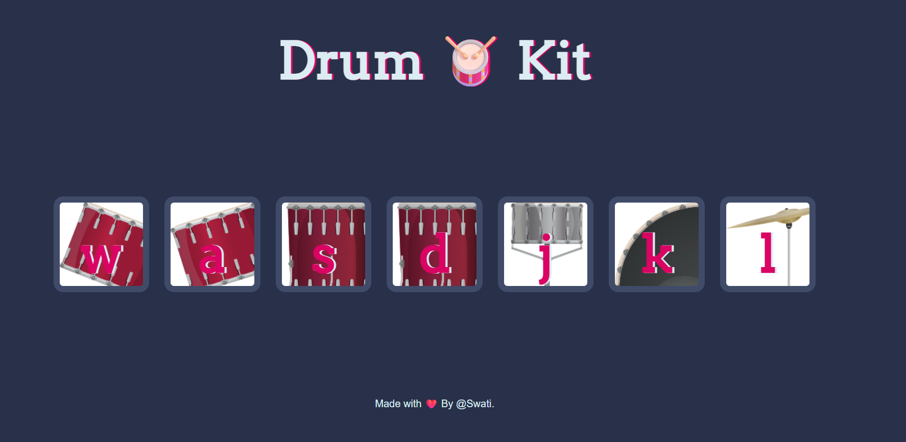

# 🥁 Drum Kit Web Application


An **interactive drum kit web application** built using **HTML, CSS, and JavaScript**.
Users can play drum sounds either by **clicking the drum buttons** or by **pressing keys on the keyboard**, creating a fun and engaging musical experience directly in the browser.

---

# 🚀 Live Demo

You can run the project locally by opening `index.html` in your browser.

Deployed Link : **https://drum-play-rosy.vercel.app/**

---

# 📸 Preview



---

# ✨ Features

✅ Interactive drum buttons
✅ Keyboard support for playing drums
✅ Realistic drum sound effects
✅ Button animation on press
✅ Responsive layout
✅ Lightweight and fast

---

# 🛠️ Technologies Used

| Technology                  | Purpose                        |
| --------------------------- | ------------------------------ |
| **HTML5**                   | Structure of the web page      |
| **CSS3**                    | Styling and layout             |
| **JavaScript (Vanilla JS)** | Event handling and sound logic |

---

# 📂 Project Structure

```
drum-kit/
│
├── index.html
├── styles.css
├── index.js
│
├── sounds/
│   ├── tom-1.mp3
│   ├── tom-2.mp3
│   ├── tom-3.mp3
│   ├── tom-4.mp3
│   ├── snare.mp3
│   ├── kick-bass.mp3
│   └── crash.mp3
│
└── images/
    ├── tom1.png
    ├── tom2.png
    ├── tom3.png
    ├── snare.png
    ├── kick.png
    └── crash.png
```

---

# 🎮 Controls

| Key   | Drum      |
| ----- | --------- |
| **W** | Tom 1     |
| **A** | Tom 2     |
| **S** | Tom 3     |
| **D** | Tom 4     |
| **J** | Snare     |
| **K** | Kick Bass |
| **L** | Crash     |

Users can either **click the buttons** or **press the keyboard keys** to trigger the sounds.

---

# ⚙️ How to Run the Project

### 1️⃣ Clone the repository

```
git clone https://github.com/Swatibharti46/drum_play.git
```

### 2️⃣ Navigate to the folder

```
cd drum_play
```

### 3️⃣ Open the project

Open **index.html** in any browser.

---

# 🧠 JavaScript Logic

The application uses **event listeners** to detect button clicks and keyboard presses.

Main functionality includes:

* Detecting key presses
* Playing corresponding audio
* Animating pressed buttons

---

# 📈 Future Improvements

* Add **mobile touch support**
* Add **drum recording feature**
* Add **sound visualizer**
* Improve **UI animations**
* Add **volume control**

---

# 👩‍💻 Author

**Swati Bharti**

Computer Science Engineering (Cyber Security,IoT,Blockchain)

---

# ⭐ Support

If you found this project helpful:

⭐ Star the repository
🍴 Fork the project
📢 Share with others
